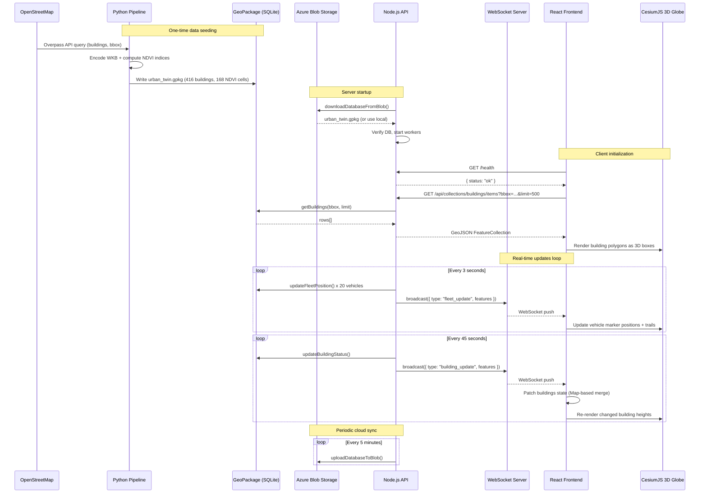
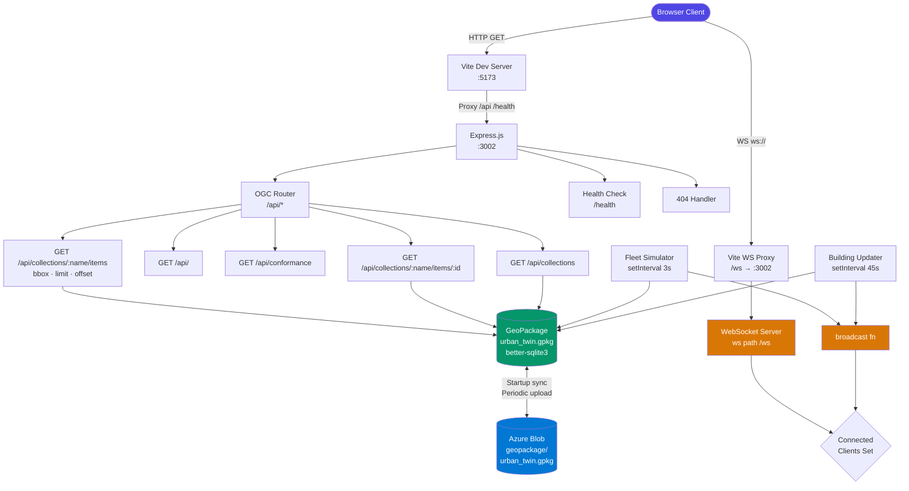
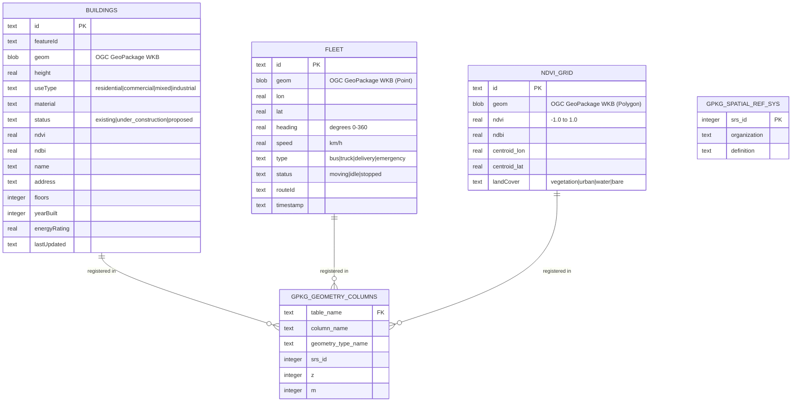
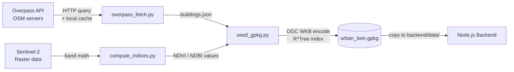
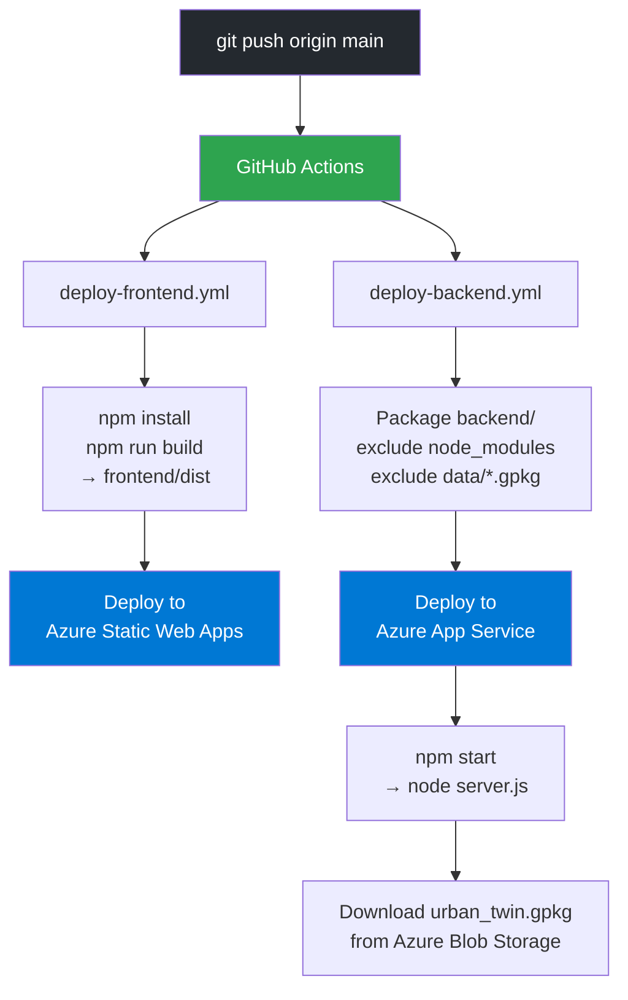

<div align="center">

# 3D Urban Digital Twin

**A production-grade, real-time 3D city visualization platform** — streaming live geospatial data through an OGC-compliant REST API to an interactive Cesium globe with WebSocket-powered fleet tracking.

[](https://nodejs.org/)
[](https://reactjs.org/)
[](https://cesium.com/)
[](https://ogcapi.ogc.org/features/)
[](https://azure.microsoft.com/)
[](./LICENSE)
[](https://www.geopackage.org/)
[](https://developer.mozilla.org/en-US/docs/Web/API/WebSockets_API)

[**Live Demo**](https://github.com/Selashkumar/3D-Urban-Digital-Twin) &nbsp;·&nbsp; [**API Docs**](#ogc-api-reference) &nbsp;·&nbsp; [**Deploy to Azure**](#azure-deployment)

</div>

---

## Table of Contents

- [Overview](#overview)
- [Key Features](#key-features)
- [Architecture](#architecture)
- [System Flow](#system-flow)
- [Request Flow Diagram](#request-flow-diagram)
- [Data Layer Schema](#data-layer-schema)
- [Tech Stack](#tech-stack)
- [Project Structure](#project-structure)
- [Quick Start](#quick-start)
- [Data Pipeline](#data-pipeline)
- [OGC API Reference](#ogc-api-reference)
- [WebSocket Protocol](#websocket-protocol)
- [Azure Deployment](#azure-deployment)
- [CI/CD Pipeline](#cicd-pipeline)
- [Environment Variables](#environment-variables)
- [License](#license)

---

## Overview

The **3D Urban Digital Twin** is a full-stack geospatial platform that renders a living, breathing digital replica of a metropolitan study area (Midtown Manhattan, ~2km²). It combines:

- **Real OSM building footprints** seeded via Python + Overpass API
- **OGC API – Features** (Part 1 Core compliant) served from a SQLite GeoPackage
- **Live WebSocket streams** pushing vehicle positions every 3 seconds
- **CesiumJS 3D globe** with ESRI World Imagery, building extrusions, NDVI overlays, and cinematic flythrough mode
- **Azure Cloud deployment** with Blob Storage GeoPackage sync, App Service backend, and Static Web App frontend

This project demonstrates how modern smart-city infrastructure can be built entirely on open standards — OGC Features, GeoJSON, WKB geometries, and GeoPackage — without vendor lock-in.

---

## Key Features

| Feature | Description |
|---|---|
| **3D Cesium Globe** | Google Earth-style navigation with ORBIT, WALK, and FLYTHROUGH camera modes |
| **Live Fleet Tracking** | 20 vehicles (bus, truck, delivery, emergency) moving in real-time via WebSocket |
| **Building Extrusions** | 400+ OSM building footprints colour-coded by use type with construction simulation |
| **NDVI Heatmap Layer** | Normalized Difference Vegetation Index grid rendered as a transparency overlay |
| **OGC API Compliant** | Full OGC API – Features Part 1 with pagination, bbox filtering, and GeoJSON responses |
| **Azure Blob Sync** | GeoPackage auto-syncs to Azure Blob Storage on startup and periodically |
| **WebSocket Push** | Server-to-client push for fleet positions and building construction state changes |
| **Satellite Imagery** | ESRI World Imagery base layer with toggleable overlay controls |

---

## Architecture

```
┌─────────────────────────────────────────────────────────────────────────────────┐
│                          3D URBAN DIGITAL TWIN — SYSTEM ARCHITECTURE            │
└─────────────────────────────────────────────────────────────────────────────────┘

  ┌──────────────────────────────────────────────────────────────────────────────┐
  │                        DATA ORIGIN & INGESTION LAYER                         │
  │                                                                              │
  │  ┌──────────────────┐    ┌──────────────────┐    ┌────────────────────────┐ │
  │  │   OpenStreetMap  │    │  Overpass API    │    │  Sentinel-2 Imagery   │ │
  │  │  Building Data   │───▶│  (overpass_      │    │  (NDVI computation)   │ │
  │  │  (Polygons/WKB)  │    │  fetch.py)       │    │  compute_indices.py   │ │
  │  └──────────────────┘    └────────┬─────────┘    └───────────┬────────────┘ │
  │                                   │                           │              │
  │                           ┌───────▼───────────────────────────▼────────┐    │
  │                           │           seed_gpkg.py (Python)            │    │
  │                           │  • Encodes WKB + GeoPackage binary geom    │    │
  │                           │  • R*Tree spatial indexes                  │    │
  │                           │  • Seeded NDVI grid (168 cells)            │    │
  │                           └───────────────────┬─────────────────────────┘   │
  └───────────────────────────────────────────────│─────────────────────────────┘
                                                  │
                                                  ▼
  ┌──────────────────────────────────────────────────────────────────────────────┐
  │                          PERSISTENCE & SYNC LAYER                            │
  │                                                                              │
  │  ┌─────────────────────────────────┐      ┌───────────────────────────────┐ │
  │  │   urban_twin.gpkg (SQLite)      │◀────▶│   Azure Blob Storage          │ │
  │  │                                 │      │   Container: "geopackage"     │ │
  │  │  Tables:                        │      │   Blob: "urban_twin.gpkg"     │ │
  │  │  • buildings  (416 features)    │      │                               │ │
  │  │  • fleet      (20 vehicles)     │      │   azureStorage.js:            │ │
  │  │  • ndvi_grid  (168 cells)       │      │   • download on startup       │ │
  │  │  • gpkg_geometry_columns        │      │   • upload every 5 min        │ │
  │  │  • gpkg_spatial_ref_sys         │      │                               │ │
  │  └─────────────────────────────────┘      └───────────────────────────────┘ │
  └──────────────────────────────────────────────────────────────────────────────┘
                                  │
                                  ▼
  ┌──────────────────────────────────────────────────────────────────────────────┐
  │                         BACKEND API LAYER  (Node.js / Express)               │
  │                                                                              │
  │  ┌────────────────────────────────────────────────────────────────────────┐ │
  │  │  server.js                                                             │ │
  │  │  ┌───────────────────────────┐  ┌──────────────────────────────────┐  │ │
  │  │  │   OGC API Routes          │  │   WebSocket Server (ws)          │  │ │
  │  │  │   /api/                   │  │   Path: /ws                      │  │ │
  │  │  │   /api/conformance        │  │                                  │  │ │
  │  │  │   /api/collections        │  │   broadcast() function:          │  │ │
  │  │  │   /api/collections/{name}/│  │   pushes to all connected        │  │ │
  │  │  │     items                 │  │   clients (Set-based tracking)   │  │ │
  │  │  │   /api/collections/{name}/│  │                                  │  │ │
  │  │  │     items/{id}            │  └──────────────┬───────────────────┘  │ │
  │  │  │   /health                 │                 │                      │ │
  │  │  └──────────────┬────────────┘                 │                      │ │
  │  │                 │                              │                      │ │
  │  │  ┌──────────────▼──────────┐  ┌───────────────▼─────────────────┐   │ │
  │  │  │  database.js            │  │  Workers (in-process)            │   │ │
  │  │  │  better-sqlite3         │  │                                  │   │ │
  │  │  │  • getBuildings()       │  │  fleetSimulator.js  (3s tick)   │   │ │
  │  │  │  • getFleet()           │  │  • linear movement model         │   │ │
  │  │  │  • getNdviGrid()        │  │  • bbox bounce                   │   │ │
  │  │  │  • updateFleetPosition()│  │  • heading drift ±5°             │   │ │
  │  │  │  • rowToFeature()       │  │                                  │   │ │
  │  │  │  • WAL mode enabled     │  │  buildingUpdater.js (45s tick)  │   │ │
  │  │  └─────────────────────────┘  │  • construction height changes   │   │ │
  │  │                               │  • status transitions            │   │ │
  │  │                               └──────────────────────────────────┘   │ │
  │  └────────────────────────────────────────────────────────────────────────┘ │
  └──────────────────────────────────────────────────────────────────────────────┘
                                  │ HTTP + WebSocket
                                  ▼
  ┌──────────────────────────────────────────────────────────────────────────────┐
  │                        FRONTEND LAYER  (React + Vite)                        │
  │                                                                              │
  │  ┌────────────────────────────────────────────────────────────────────────┐ │
  │  │  App.jsx (Root)                                                        │ │
  │  │  ┌──────────────────┐  ┌──────────────────┐  ┌──────────────────────┐ │ │
  │  │  │  useOGCData()    │  │  useLiveUpdates()│  │  State Management    │ │ │
  │  │  │  Fetches initial │  │  WebSocket hook  │  │  buildings[]         │ │ │
  │  │  │  GeoJSON on load │  │  auto-reconnect  │  │  liveFleetData       │ │ │
  │  │  │  bbox + limit    │  │  patches state   │  │  selectedBuilding    │ │ │
  │  │  └──────────────────┘  └──────────────────┘  └──────────────────────┘ │ │
  │  │                                                                        │ │
  │  │  ┌──────────────────────────────────────────────────────────────────┐ │ │
  │  │  │  CesiumMap3D.jsx  (Main 3D Canvas)                              │ │ │
  │  │  │  • window.Cesium (loaded from /public/cesium)                   │ │ │
  │  │  │  • ESRI World Imagery base layer                                │ │ │
  │  │  │  • Building polygons → coloured 3D boxes (useType colour map)  │ │ │
  │  │  │  • NDVI grid → transparent polygon overlay                      │ │ │
  │  │  │  • Fleet vehicles → animated point markers with trails          │ │ │
  │  │  │  • Camera modes: ORBIT / WALK / FLYTHROUGH                      │ │ │
  │  │  └──────────────────────────────────────────────────────────────────┘ │ │
  │  │                                                                        │ │
  │  │  ┌──────────────┐  ┌──────────────┐  ┌──────────────┐  ┌───────────┐ │ │
  │  │  │  StatsBar    │  │  Sidebar /   │  │  FleetPanel  │  │ Building  │ │ │
  │  │  │  Live counts │  │  LayerCtrl   │  │  Vehicle list│  │ Popup     │ │ │
  │  │  └──────────────┘  └──────────────┘  └──────────────┘  └───────────┘ │ │
  │  └────────────────────────────────────────────────────────────────────────┘ │
  └──────────────────────────────────────────────────────────────────────────────┘
```

---

## System Flow



---

## Request Flow Diagram



---

## Data Layer Schema



---

## Tech Stack

| Layer | Technology | Purpose |
|---|---|---|
| **3D Renderer** | [CesiumJS](https://cesium.com/) | Globe, terrain, 3D building extrusions, imagery layers |
| **Frontend** | React 18 + Vite | SPA, component state, WebSocket hooks |
| **Styling** | Vanilla CSS (custom design system) | Glassmorphism UI, CSS variables, animations |
| **Backend** | Node.js + Express | HTTP server, CORS, request routing |
| **OGC API** | Custom OGC Features router | Part 1 conformant GeoJSON endpoints |
| **WebSockets** | `ws` library | Real-time bidirectional push |
| **Database** | `better-sqlite3` | Synchronous GeoPackage read/write |
| **DB Format** | OGC GeoPackage (SQLite) | Standards-compliant spatial container, WKB geom |
| **Cloud Storage** | Azure Blob Storage (`@azure/storage-blob`) | GeoPackage sync / persistence |
| **Hosting** | Azure App Service + Azure Static Web Apps | Production deployment |
| **CI/CD** | GitHub Actions | Automated deploy on push to `main` |
| **Data Pipeline** | Python 3 + SQLite + Requests | OSM ingestion, NDVI computation, GeoPackage seeding |

---

## Project Structure

```
3D-Urban-Digital-Twin/
│
├── backend/                           # Node.js OGC API server
│   ├── server.js                      # Express + WebSocket server entry point
│   ├── package.json
│   ├── web.config                     # Azure IIS node configuration
│   │
│   ├── routes/
│   │   └── ogc.js                     # OGC API – Features router (all endpoints)
│   │
│   ├── db/
│   │   ├── database.js                # better-sqlite3 wrapper, GeoPackage queries
│   │   └── seed.js                    # Mock data seeder (Node.js, quick start)
│   │
│   ├── workers/
│   │   ├── fleetSimulator.js          # Vehicle movement engine (3s interval)
│   │   └── buildingUpdater.js         # Construction state engine (45s interval)
│   │
│   ├── utils/
│   │   └── azureStorage.js            # Azure Blob upload/download sync
│   │
│   ├── middleware/
│   │   └── logger.js                  # HTTP request logger
│   │
│   └── data/
│       └── urban_twin.gpkg            # GeoPackage database (git-ignored)
│
├── frontend/                          # React + Vite SPA
│   ├── index.html                     # App shell
│   ├── vite.config.js                 # Vite config + dev proxy
│   ├── package.json
│   │
│   └── src/
│       ├── App.jsx                    # Root component, state orchestration
│       ├── main.jsx                   # React entry point
│       ├── index.css                  # Design system (CSS variables, animations)
│       │
│       ├── components/
│       │   ├── CesiumMap3D.jsx        # 3D globe renderer (Cesium)
│       │   ├── Map3D.jsx              # MapLibre fallback renderer
│       │   ├── StatsBar.jsx           # Top stats strip (buildings, vehicles, status)
│       │   ├── Sidebar.jsx            # Collapsible side panel shell
│       │   ├── LayerControls.jsx      # Layer visibility toggles
│       │   ├── FleetPanel.jsx         # Live vehicle list panel
│       │   └── BuildingPopup.jsx      # Building detail overlay
│       │
│       ├── hooks/
│       │   ├── useLiveUpdates.js      # WebSocket hook (auto-reconnect, state patch)
│       │   └── useOGCData.js          # OGC API fetch hook (loading, error, data)
│       │
│       └── utils/
│           ├── mapConfig.js           # Bounding box, city centre constants
│           └── apiConfig.js           # API base URL helper (env-aware)
│
├── data-pipeline/                     # Python geospatial processing
│   ├── overpass_fetch.py              # Fetch OSM building footprints via Overpass
│   ├── seed_gpkg.py                   # Seed OGC GeoPackage from OSM data
│   ├── compute_indices.py             # Compute NDVI / NDBI raster indices
│   └── requirements.txt
│
├── .github/
│   └── workflows/
│       ├── deploy-backend.yml         # CI/CD: Azure App Service
│       └── deploy-frontend.yml        # CI/CD: Azure Static Web Apps
│
├── azure_deployment_guide.md          # Step-by-step Azure setup guide
├── LICENSE                            # MIT
└── README.md                          # This file
```

---

## Quick Start

### Prerequisites

| Tool | Version | Notes |
|---|---|---|
| Node.js | 18+ | [nodejs.org](https://nodejs.org/) |
| npm | 9+ | Bundled with Node.js |
| Python | 3.9+ | Required for data pipeline only |

### 1 · Clone the repository

```bash
git clone https://github.com/Selashkumar/3D-Urban-Digital-Twin.git
cd 3D-Urban-Digital-Twin
```

### 2 · Seed the database

```bash
cd backend
npm install
npm run seed        # generates backend/data/urban_twin.gpkg
```

> The seed script creates **416 buildings**, **20 fleet vehicles**, and **168 NDVI grid cells** using deterministic mock data — no external API calls required.

### 3 · Start the backend

```bash
# still inside /backend
npm run dev         # starts on http://localhost:3002
```

Verify the server is running:

```bash
curl http://localhost:3002/health
# → {"status":"ok","uptime":...}

curl http://localhost:3002/api/collections
# → OGC FeatureCollection list
```

### 4 · Start the frontend (new terminal)

```bash
cd frontend
npm install
npm run dev         # starts on http://localhost:5173
```

Open **http://localhost:5173** — the Vite dev server proxies `/api`, `/health`, and `/ws` to the backend on port 3002 automatically.

---

## Data Pipeline

The Python data pipeline in `data-pipeline/` provides optional real-world OSM data ingestion as an alternative to the Node.js seed script.

### Pipeline Overview



### Running the Python pipeline

```bash
cd data-pipeline
pip install -r requirements.txt

# Step 1: Fetch OSM buildings (cached after first run)
python overpass_fetch.py --bbox "40.735,-73.995,40.760,-73.975"

# Step 2: Compute vegetation indices (optional, requires Sentinel-2 data)
python compute_indices.py

# Step 3: Seed the GeoPackage
python seed_gpkg.py
# Output: backend/data/urban_twin.gpkg
```

> **Note:** The Python `seed_gpkg.py` uses a slightly different internal schema than `backend/db/seed.js`. For the live app, use `npm run seed` in the backend. Use the Python pipeline when you need real OSM geometry.

---

## OGC API Reference

The backend implements **OGC API – Features Part 1: Core**, conformance class `http://www.opengis.net/spec/ogcapi-features-1/1.0/conf/core`.

### Base URL

```
http://localhost:3002/api                              (local dev)
https://<your-app>.azurewebsites.net/api               (Azure)
```

### Endpoints

| Method | Path | Description | Query Params |
|---|---|---|---|
| `GET` | `/api/` | Landing page — API metadata and links | — |
| `GET` | `/api/conformance` | OGC conformance class declarations | — |
| `GET` | `/api/collections` | List all feature collections with metadata | — |
| `GET` | `/api/collections/{name}` | Single collection metadata + spatial extent | — |
| `GET` | `/api/collections/{name}/items` | GeoJSON FeatureCollection | `bbox`, `limit` (max 500), `offset` |
| `GET` | `/api/collections/{name}/items/{id}` | Single GeoJSON Feature | — |
| `GET` | `/health` | Health check (used by frontend on startup) | — |

### Collections

| Collection | Geometry | Features | Update Frequency |
|---|---|---|---|
| `buildings` | Polygon | 416 | Every 45s (construction sim) |
| `fleet` | Point | 20 | Every 3s (movement sim) |
| `ndvi_grid` | Polygon | 168 | Static (seeded) |

### Example Requests

```bash
# Get all buildings in a bounding box
curl "http://localhost:3002/api/collections/buildings/items?bbox=-73.99,40.74,-73.97,40.76&limit=100"

# Get a single building by ID
curl "http://localhost:3002/api/collections/buildings/items/bldg-001"

# Get fleet positions
curl "http://localhost:3002/api/collections/fleet/items"

# Get NDVI grid
curl "http://localhost:3002/api/collections/ndvi_grid/items?limit=200"
```

### Example Response — single building feature

```json
{
  "type": "Feature",
  "id": "bldg-042",
  "geometry": {
    "type": "Polygon",
    "coordinates": [[[-73.9867, 40.7491], [-73.9865, 40.7491], "..."]]
  },
  "properties": {
    "featureId": "bldg-042",
    "height": 124.5,
    "useType": "commercial",
    "material": "glass",
    "status": "existing",
    "ndvi": 0.12,
    "floors": 38,
    "yearBuilt": 1987,
    "name": "Midtown Tower",
    "lastUpdated": "2026-06-22T14:00:00Z"
  },
  "links": [
    { "href": "http://localhost:3002/api/collections/buildings/items/bldg-042", "rel": "self" },
    { "href": "http://localhost:3002/api/collections/buildings", "rel": "collection" }
  ]
}
```

---

## WebSocket Protocol

Connect to `ws://localhost:3002/ws` (or `wss://<host>/ws` in production).

### Connection handshake

On connect, the server immediately sends:

```json
{ "type": "connected", "message": "Urban Twin WS ready" }
```

### Message Types

#### `fleet_update` — broadcast every 3 seconds

```json
{
  "type": "fleet_update",
  "timestamp": "2026-06-22T14:30:00.000Z",
  "features": [
    {
      "type": "Feature",
      "id": "fleet-001",
      "geometry": { "type": "Point", "coordinates": [-73.986, 40.749] },
      "properties": {
        "type": "bus",
        "status": "moving",
        "heading": 45.2,
        "speed": 35,
        "routeId": "M15",
        "timestamp": "2026-06-22T14:30:00.000Z"
      }
    }
  ]
}
```

#### `building_update` — broadcast every 45 seconds

```json
{
  "type": "building_update",
  "timestamp": "2026-06-22T14:30:45.000Z",
  "features": [
    {
      "type": "Feature",
      "id": "bldg-007",
      "geometry": { "type": "Polygon", "coordinates": [[]] },
      "properties": {
        "featureId": "bldg-007",
        "height": 87.0,
        "status": "under_construction",
        "lastUpdated": "2026-06-22T14:30:45.000Z"
      }
    }
  ]
}
```

### Client-side reconnect logic

The `useLiveUpdates` hook implements exponential backoff reconnection:

- Reconnect delays: 1s → 2s → 4s → 8s … (capped at 30s)
- Buildings state is patched using a `Map`-based feature merge — no full re-render on updates

---

## Azure Deployment

The project deploys to two Azure services with full CI/CD via GitHub Actions.

### Azure Architecture

```
┌────────────────────────────────────────────────────────────────┐
│                        AZURE CLOUD                             │
│                                                                │
│  ┌─────────────────────────┐     ┌────────────────────────┐   │
│  │   Azure Static Web App  │     │   Azure App Service    │   │
│  │   (Frontend - React)    │     │   (Backend - Node.js)  │   │
│  │                         │     │                        │   │
│  │  • Auto-built by GitHub │     │  • Node 22 LTS Linux   │   │
│  │    Actions on push      │     │  • WebSockets enabled  │   │
│  │  • Global CDN           │     │  • web.config (IISNode)│   │
│  │  • HTTPS by default     │◀────│  • PORT env variable   │   │
│  │                         │ API │                        │   │
│  │  VITE_API_BASE_URL ─────┼────▶│  /api /health /ws      │   │
│  │  VITE_WS_BASE_URL  ─────┼────▶│  wss://...             │   │
│  └─────────────────────────┘     └───────────┬────────────┘   │
│                                              │                 │
│                                  ┌───────────▼────────────┐   │
│                                  │  Azure Blob Storage    │   │
│                                  │  Container: geopackage │   │
│                                  │  Blob: urban_twin.gpkg │   │
│                                  │                        │   │
│                                  │  AZURE_STORAGE_        │   │
│                                  │  CONNECTION_STRING     │   │
│                                  └────────────────────────┘   │
└────────────────────────────────────────────────────────────────┘
```

### Step-by-step deployment

See [**azure_deployment_guide.md**](./azure_deployment_guide.md) for the full walkthrough including screenshots and troubleshooting notes.

**Summary:**

```
1. Create Azure App Service (Node 22, Linux, B1+)
2. Enable WebSockets in App Service → Configuration → General settings
3. Set environment variable on App Service:
   AZURE_STORAGE_CONNECTION_STRING = <your blob connection string>
4. Create Azure Static Web App linked to this repo
5. Add GitHub Secrets (see table below)
6. Push to main — GitHub Actions deploys both services automatically
```

---

## CI/CD Pipeline



### Required GitHub Secrets

| Secret | Workflow | Description |
|---|---|---|
| `AZURE_WEBAPP_NAME` | `deploy-backend.yml` | App Service name (e.g. `3d-urban-twin-backend`) |
| `AZURE_WEBAPP_PUBLISH_PROFILE` | `deploy-backend.yml` | Download from App Service → Get publish profile |
| `AZURE_STATIC_WEB_APPS_API_TOKEN` | `deploy-frontend.yml` | Found in Static Web App → Manage deployment token |
| `VITE_API_BASE_URL` | `deploy-frontend.yml` | e.g. `https://3d-urban-twin-backend.azurewebsites.net` |
| `VITE_WS_BASE_URL` | `deploy-frontend.yml` | e.g. `wss://3d-urban-twin-backend.azurewebsites.net` |

---

## Environment Variables

### Backend (`backend/`)

| Variable | Required | Description |
|---|---|---|
| `PORT` | No | HTTP port (default: `3002`) |
| `AZURE_STORAGE_CONNECTION_STRING` | No | Azure Blob Storage connection string. If unset, Blob sync is skipped and the local `data/urban_twin.gpkg` is used. |

### Frontend (`frontend/`)

| Variable | Local Default | Production |
|---|---|---|
| `VITE_API_BASE_URL` | *(empty — uses Vite proxy)* | `https://<backend>.azurewebsites.net` |
| `VITE_WS_BASE_URL` | *(empty — uses Vite proxy)* | `wss://<backend>.azurewebsites.net` |
| `VITE_CESIUM_ION_TOKEN` | *(empty — no Cesium ion assets)* | Your [Cesium ion](https://ion.cesium.com/) access token for premium terrain and imagery |

---

## License

This project is licensed under the **MIT License** — see [LICENSE](./LICENSE) for details.

---

<div align="center">

Built on open geospatial standards

[](https://ogcapi.ogc.org/features/)
[](https://www.geopackage.org/)
[](https://geojson.org/)
[](https://cesium.com/)

</div>
